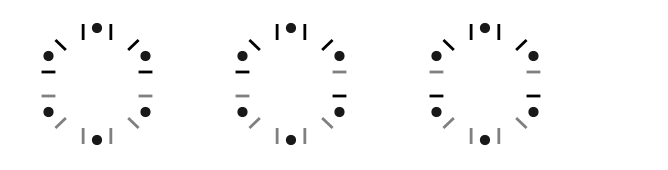
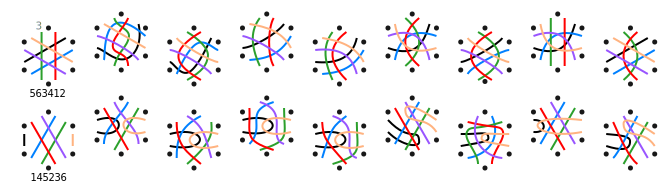
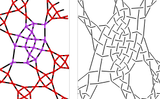
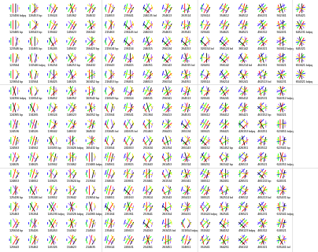
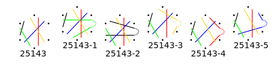
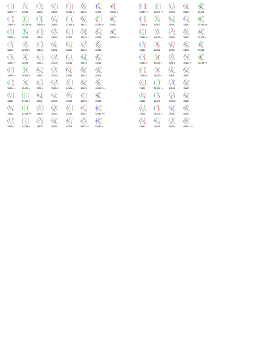

Counting snowflake families
===========================

Intro
-----

...

Thread diagrams for 2,3,4,5 pairs can be used as pair diagrams for 4,6,8,10 pairs. 
So when analyzing how threads/pairs can get reordered at the end of some manipulation,
we get two for the price of 1.

The numbers for 4 and 5 pairs are part of the numbers for 
6 pairs with a pair leaving before the last enters.

...

### Reading hints

You can  use a vector editor (like Inkscape) to apply changes to the **downloads**. 
For example bend the straight lines into workable pair diagrams or show what is beyond the visible area. 

Some sets of permutations are provided as **text files**, grouped by reflections. 
Only the smallest number in each group is presented as a diagram.
When you find a snowflake somewhere else, write down how the pairs reorder
and look up the number in this list to identify the family.

**A Python [script](permutations.py)** renders permutations of pairs changing positions and filter reflections.
You can run (and modify) the script with various offline and online environments such as
[online-python.com](https://www.online-python.com/)
The output of the scripts is hacked into SVG documents mentioned/shown on this page.
The numbers show the order of the pairs at the end. Those marked with a `*` and/or `+` have an internal reflection.
By switching comment on or off for the last few lines you can choose what to generate.

6 pairs / threads
-----------------

We have three main groups of snowflakes shown by the diagrams below. Pairs start at black lines and end at grey lines.
Please note the difference in the horizontal marks.

There are many ways how the pairs can get reordered after making a snowflake,
or in other words: how we can draw straight lines connecting each black line 
in a hexagon with a grey line within the same hexagon.
The same reordering might be achieved in multiple ways of curved lines that form valid pair diagrams,
we call these groups a family.

The details that follow per group tell us we have 230+325+149=704 families. 
Varying stitches for each family-member gives an ocean of options.

### All pairs entering before any pair leaves

With six threads or pairs we have 6x5x4x3x2=720 permutations for the order of pairs after completing a snowflake.
After filtering reflected versions we still have [230 options](permutations-for-6.txt).
20 have internal bdpq reflections, another 28 have only bd reflections (marked with a +) an           d 28 have bp (marked with a *).

These permutations are heads of families. Only sometimes this family-head is a workable diagram.
Workable or not, you can bend the pairs of a permutation into (more) workable diagrams.
When swapping starts and/or ends you are interfering with another family. 
The not-exhaustive families below are created manually from some of the generated permutations.

  
The [download](654321.svg) contains a few more examples beyond the visible area.

One of the examples has blobs to identify stitches.
Requirements for the blobs: span 4 threads, share two threads with each adjacent blob. 
Not all blobs use all of its four threads.
You can assign the thus discovered stitches to one of the templates for 
[4](/GroundForge/stitches?patchWidth=7&patchHeight=9&tile=5-C-B-,-5-5-5,5-5-5-,-5-5-5,--5-5-,-B---C,&shiftColsSW=0&shiftRowsSW=6&shiftColsSE=6&shiftRowsSE=6&e1=ct&c1=ct&a1=rrctctt&f2=llctctt&d2=ttctctt&b2=rrctctt&e3=ctctt&c3=ctctt&a3=ctctt&f4=ct&d4=ctctt&b4=ct&e5=ct&c5=ct&f6=ct&b6=ct),
[5](/GroundForge/stitches?patchWidth=7&patchHeight=9&tile=-B-5-C,5-5-5-,-5-5-5,--5-5-,-B---C,--C-B-,&shiftColsSW=0&shiftRowsSW=6&shiftColsSE=6&shiftRowsSE=6&f1=ct&d1=ttctctt&b1=ct&e2=rrctctt&c2=llctctt&a2=ttctctt&f3=ct&d3=ctctt&b3=ct&e4=ct&c4=ct&f5=ct&b5=ct&e6=ct&c6=ct),
[6](/GroundForge/stitches?patchWidth=7&patchHeight=11&tile=5-C-B-,-5-5-5,5-5-5-,-5-5-5,--5-5-,-B---C,--C-B-,-B---C,&shiftColsSW=0&shiftRowsSW=8&shiftColsSE=6&shiftRowsSE=8&e1=ct&c1=ct&a1=rrctctt&f2=llctctt&d2=ttctctt&b2=rrctctt&e3=ctctt&c3=ctctt&a3=ctctt&f4=ct&d4=ctctt&b4=ct&e5=ct&c5=ct&f6=ct&b6=ct&e7=ct&c7=ct&f8=ct&b8=ct),
[7](/GroundForge/stitches?patchWidth=7&patchHeight=13&tile=-B-5-C,5-5-5-,-5-5-5,--5-5-,-B---C,--C-B-,-B---C,--C-B-,&shiftColsSW=0&shiftRowsSW=8&shiftColsSE=6&shiftRowsSE=8&f1=ct&d1=ttctctt&b1=ct&e2=rrctctt&c2=llctctt&a2=rrctctt&f3=ct&d3=ctctt&b3=ct&e4=ct&c4=ct&f5=ct&b5=ct&e6=ct&c6=ct&f7=ct&b7=ct&e8=ct&c8=ct),
[8](/GroundForge/stitches?patchWidth=7&patchHeight=13&tile=5-C-B-,-5-5-5,5-5-5-,-5-5-5,--5-5-,-B---C,--C-B-,-B---C,--C-B-,-B---C,&shiftColsSW=0&shiftRowsSW=10&shiftColsSE=6&shiftRowsSE=10&e1=ct&c1=ct&a1=llctctt&f2=llctctt&d2=ttctctt&b2=rrctctt&e3=ctctt&c3=ctctt&a3=ctctt&f4=ct&d4=ctctt&b4=ct&e5=ct&c5=ct&f6=ct&b6=ct&e7=ct&c7=ct&f8=ct&b8=ct&e9=ct&c9=ct&f10=ct&b10=ct),
[9](/GroundForge/stitches?patchWidth=7&patchHeight=13&tile=-B-5-C,5-5-5-,-5-5-5,--5-5-,-B---C,--C-B-,-B---C,--C-B-,-B---C,--C-B-,&shiftColsSW=0&shiftRowsSW=10&shiftColsSE=6&shiftRowsSE=10&f1=ct&d1=ttctctt&b1=ct&e2=rrctctt&c2=llctctt&a2=ttctctt&f3=ct&d3=ctctt&b3=ct&e4=ct&c4=ct&f5=ct&b5=ct&e6=ct&c6=ct&f7=ct&b7=ct&e8=ct&c8=ct&f9=ct&b9=ct&e10=ct&c10=ct),
...
stitches/blobs. Is the first blob on the right? Then replace the half stitches in the right plait. Vice versa for left.
Next step: follow the link "_thread diagram as pair diagram_" for a thread diagram of the snowflake with stitches of your choice.  

The [blobs](/GroundForge/droste.html?patchWidth=7&patchHeight=11&tile=5-C-B-,-5-5-5,5-5-5-,-5-5-5,--5-5-,-B---C,--C-B-,-B---C&shiftColsSW=0&shiftRowsSW=8&shiftColsSE=6&shiftRowsSE=8&e1=crcl&c1=ctctt&a1=ttctctt&f2=llctctt&d2=rrctctt&b2=ctctt&e3=ctctt&c3=ctctt&a3=ctctt&f4=rclc&d4=ctctt&b4=ctc&e5=cr&c5=ctc&f6=cr&b6=ctc&e7=lcr&c7=ctc&f8=c&b8=ctc&droste2=ctct,a34=f41=f42=f43=e50=e51=f60=f61=e70=e71=e72=f80=e90=e91=e92=e93=e11=e10=e12=e13=ctc)
with cloth stitches at the droste page:  
  

You can [download](all-in-before-any-out.svg) the following filtered permutations.    
  

### One pair leaves before the last one enters

With one pair going out and back in again we have (5x4x3x2 - bp reflections) = 73 options,
5 options each to pull one  pair out gives 365 options.
However, the permutations marked with `+` cause duplicates by swapped pairs.
So we expect to end up with 365-40=325.

You can [download](pull-out.svg) this example of pulling out pairs from one permutation.  
  
Note that two pairs within each snowflake prototype have the same color.
The dashed line outside the snowflake suggests it is the same pair.
That might not be the case, depending on what happens outside the spider.
It is a reminder that you should not bend the lines in such a way
that two lines of the same color intersect one another.

You can [download](one-out-before-in.svg) the permutations for one pair returning.  

### Two pairs leave before the last ones enter

With two pairs going out and back in we start with (4x3x2 - bp and bd reflections) =
[13 options](permutations-for-4.txt). These are shown on the grey ribbon.
2 have bdpq reflections, 2 only bd and 1 a bp reflection.

Above the ribbon we have 4x3 options for each one to pull out two pairs what gives 156 options.
Removing duplicates leaves 93. 

Below the ribbon we have 4x2 options to pull out one pair to both sides, two because we can start pulling to the right or start to the left.
That gives another 56, unless someone can still spot duplicates when flipping horizontally and/or vertically.

Both groups add up to 149.

You can [download](two-out-before-in.svg) the collection below.
