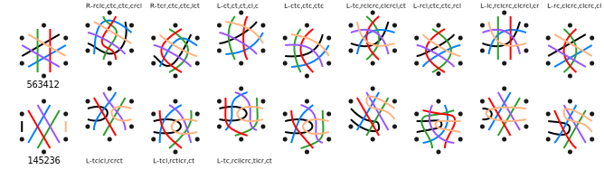

Counting snowflake families
===========================

Intro
-----

...

Thread diagrams for 2,3,4,5 pairs can be used as pair diagrams for 4,6,8,10 pairs. 
So when analyzing how threads/pairs can get reordered at the end of some manipulation,
we get two for the price of 1.

...

### Reading guide

Python script(s) render permutations of pairs changing positions and filter reflections.
You can run (and modify) a script with various offline and online environments such as
[online-python.com](https://www.online-python.com/)
The output of the scripts is hacked into SVG documents mentioned/shown on this page.
The numbers show the order of the pairs at the end. Those marked with a `*` and/or `+` have an internal reflection.

You can  use a vector editor (like Inkscape) to apply changes to the downloads. 
For example bend the straight lines into workable pair diagrams.

All permutations are provided as text, grouped by reflections. 
Only the smallest number in each group is presented as a diagram.
When you find a snowflake in the wild, write down how the reordering of the pairs
and look up the number in this list to identify the family.

3/6 pairs
---------

### All pairs entering before any pair leaves

With six threads or pairs we have 6x5x4x3x2=720 permutations.
After filtering reflections with we still have [230 options](permutations-for-6.txt).
20 have internal bdpq reflections, 28 have bd and 28 have bp.

You can [download](654321.svg) this not-exhaustive family.
This example is created manually from one of the generated permutations,
which happens to be workable by itself.
The pairs are just bent, start and end stayed put.
  

One example has blobs to identify stitches.
Each blob covers 4 threads. The blobs share two threads with one previous blob and two with another. 
Only some of the threads in a blob may be used.
The stitches are applied to a [3-pair plait](/GroundForge/stitches.html?patchWidth=7&patchHeight=13&tile=5-C-B-,-5-5-5,5-5-5-,-5-5-5,--5-5-,-B---C,--C-B-,-B---C,--C-B-,-B---C,&shiftColsSW=0&shiftRowsSW=10&shiftColsSE=6&shiftRowsSE=10&e1=llctctt&c1=ctctt&a1=ctctt&f2=ctctt&d2=ctctt&b2=ctctt&e3=ctctt&c3=ctctt&a3=ctctt&f4=rclc&d4=ctctt&b4=ctc&e5=cr&c5=ctc&f6=cr&b6=ctc&e7=lcr&c7=ctc&f8=c&b8=ctc&e9=crcl&c9=ctc&f10=rttctctt&b10=ctc).  
TO DO: a generic recipe 

You can [download](all-in-before-any-out.svg) the following filtered permutations
generated with this [script](all-in-before-any-out.py).    
  

### Pairs leaving before the last enters

Composition requirements: ... next to cloth stitch ... side by side ...

...

With one pair going out and in again we have (5x4x3x2 - reflections) = 
[45 options](permutations-for-5.txt), 5 options each to pull one  pair out gives 225 options.
6 options have bdpq reflection, 21 have either bd or bp reflection.

With two pars going out and in we have (4x3x2 - reflections) =
[13 options](permutations-for-4.txt), 4x3 options each to pull two pairs out gives 156 options.
6 have bdpq reflections, 5 have either bd or pq reflections.

The two groups add up to 381 options.
