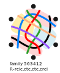

Counting snowflake families
===========================

**... and crossings with fewer pairs**

Contents
--------

  * [Introduction](#introduction)
  * [Bouncing pairs and numbering](#bouncing-pairs-and-numbering)
  * [Notes](#notes)
    * [Pairs or threads](#pairs-or-threads)
    * [Save and edit images](#save-and-edit-images)
    * [Look up of snowflakes](#look-up-of-snowflakes)
    * [Generated content](#generated-content)
  * [6 pairs / threads](#6-pairs--threads)
    * [No bouncing](#no-bouncing)
    * [Bouncing once](#bouncing-once)
    * [Bouncing twice](#bouncing-twice)
  * [5 pairs / threads](#5-pairs--threads)
  * [4 pairs / threads](#4-pairs--threads)
  * [3 pairs](#3-pairs)
  * [2 pairs](#2-pairs)
  * [Exploring families](#exploring-families)
    * [Valid pair diagrams](#valid-pair-diagrams)
    * [Choose stitches](#choose-stitches)

Introduction
------------

From [literature](../literature) like "Naar de Bron" and "Viele gute Gründe"
we can collect dozens of pair diagrams for snowflakes. 
That made us curious to explore the number of ways we can make n-pair crossings.
Traditional spiders are crossings with an even number of pairs, 
snowflakes in Binche are usually 4-pair or 6-pair crossings.

To start the exploration we calculate the number of ways 
the pairs get reordered after completing the crossing. 
Mathematicians call that permutations.
The calculations: 

|                   | 2 | 3 |  4 |   5 |   6 |    7 |     8 |      9 |
|:-----------------:|--:|--:|---:|----:|----:|-----:|------:|-------:|
| factorial or _n!_ | 2 | 6 | 24 | 120 | 720 | 5040 | 40320 | 362880 | 
| minus reflections | 1 | 4 | 13 |  45 | 230 | 1388 | 10558 |  92126 | 

Reflections: 
options that are the same after mirroring horizontally, vertically or rotating upside down.

Because of the large numbers, we only give some examples or hints for the next steps: 
creating valid pair diagrams and choosing stitches.

Bouncing pairs and numbering
----------------------------

A pair that bounces along the perimeter of an n-pair crossing
can take a detour in the surrounding lace.
This turns an n-pair crossing into an (n+1)-pair crossing, 
it can even happen with two pairs, or one pair bouncing between both sides.
As the initial curiosity was about 6-pair snowflakes, we only explored
5-pair crossings and 4-pair crossings turned into 6-pair crossings. 

The following images illustrate how the numbering works. 
The basic numbers show the order of the pairs at the end.
A prefix and/or suffix indicates which pair bounces, 
they take the place of the first and/or last pair.
An S or Z indicates to which side a twice bouncing pair travels first.

The numbers may be marked with bd, bp or bdpq. This is about [internal symmetry](../../images/)

Notes
-----

### Pairs or threads

Thread diagrams can be interpreted as pair diagrams and vice versa.
So when analyzing in how many ways threads/pairs can get reordered at the end of some manipulation,
we get two for the price of 1. 
For example the 6-pair snowflakes are thread diagrams for 3-pair crossings.

### Save and edit images

With main stream browsers you can right-click the images on this page to save them.
You can use  a vector editor like Inkscape, Adobe Illustrator and many others, to modify images with extension SVG. 
For example to bend the straight lines into workable pair diagrams or show what is beyond the visible area. 

### Look up of snowflakes

Some sets of permutations are also provided as text files, grouped by reflections. 
Only the smallest number in each group is presented as a diagram.
When you find a snowflake somewhere else, write down how the pairs reorder
and look up the number in the text file to identify the family.
The files do not include the bouncing prefixes and suffixes.

### Generated content

Some content of this page is generated with a Python [script](permutations.py). 
It calculates and draws permutations of pairs changing positions and filters reflections.
You can run (and modify) the script with various offline and online environments such as
[online-python.com](https://www.online-python.com/)
The output of the scripts is hacked into SVG images shown on this page.
By switching comment on or off for the last few lines of the script you can choose what to generate.

6 pairs / threads
-----------------

We have three main groups of snowflakes shown by the diagrams below. Pairs start at red lines and end at blue lines.
Commonly we expect all pairs to enter before any leaves, but sometimes one or two pairs leave before the lasts enter
as depicted below: red enters, blue  leaves.
Please note the difference in the colors of the horizontal marks.
More on these three groups under [Bouncing pairs and numbering](#bouncing-pairs-and-numbering)

There are many ways how the pairs can get reordered after making a snowflake,
or in other words: how we can draw straight lines connecting each red mark
in a circle with a blue mark within the same circle.
The same reordering might be achieved in multiple ways of curved lines that form valid pair diagrams,
we call these groups families.

The details that follow per group tell us we have 230+325+149=704 families. 
Varying stitches for each family-member gives an ocean of options.

### No bouncing

With six threads or pairs we have 6x5x4x3x2=720 permutations for the order of pairs after completing a snowflake.
After filtering reflected versions we still have 230 options.
20 have internal bdpq reflections, another 28 have only bd reflections and 28 have bp.

[text](permutations-for-6.txt)  
  

### Bouncing once

With one bouncing pair we have (5x4x3x2 - bp reflections) = 73 options.
Note that this is more than for the plain 5-pair crossings where also the bd reflections are removed. 
Five options for each option to let one pair bounce gives 365 options.
However, swapped pairs in permutations marked with `bp` cause duplicates.
We expect to end up with 365-40=325.

### Bouncing twice

With two pairs bouncing, we can start with the permutations for four pairs.
These are repeated on the grey ribbon below.
two have bdpq reflections, one only bd and one a bp reflection.

Above the ribbon we have 4x3 options for each one with two pairs bouncing pairs what gives 156 options.
Removing duplicates leaves 93. 
Below the ribbon we have 4x2 options of a pair bouncing to both sides, x2 because we can start bouncing to the right or start to the left.
That gives another 56.
The groups add up to 149.

5 pairs / threads
-----------------

With 5 pais we have 5x4x3x2=120 permutations, minus bd and/or bp duplicates we have 45 family heads.
Use your own creativity to figure out members of these families.

[text](permutations-for-5.txt)    

4 pairs / threads
-----------------

With 4 pairs we have 4x3x2=24 minus duplicates gives 13 families.
The number of family members are not exhaustive.

[text](permutations-for-4.txt)  

3 pairs
-------

With 3 pairs we have 3x2=6 ways to reorder them. The faint permutations in the image below are mirrored duplicates.
Thus, we get 4 families. By bending the generated pairs we can create valid pair diagrams as family members.
Swapping starts and/or ends means dealing with another family. 
So far we show at most three members per family. 
Note that the red pair intersects the two other pairs three times each in the bottom case of family 231.
Use your own creativity to create more family members. [More...](../misca#3-paired-join) 

2 pairs
-------

Bobbin lace makers are used to call two pair crossings stitches,
these are explored on [Listing & counting stitches](counting).

Exploring families
------------------

### Valid pair diagrams

The permutations given above are only heads of families. Only sometimes this family-head is a workable diagram.
Workable or not, you can bend the pairs of a permutation into (more) workable diagrams.
When swapping starts and/or ends you are dealing with another family. 

The not-exhaustive families below are created manually from some of the generated permutations.

  
The image contains a few more examples beyond the visible area.

With bouncing pairs two or three pairs in a family-head have the same color.
The dashed line outside the snowflake suggests it is the same pair.
That might not be the case, depending on what happens outside the snowflake.
It is a reminder that you should not bend the lines in such a way
that two lines of the same color intersect one another.

### Choose stitches

The last step is choose stitches for a thread diagram. 
For that purpose we can use the droste page of GroundForge and have to interpret the diagrams as thread diagrams. 
We can analyse the stitches by marking them with blobs. Two solutions for one snowflake:

  

Requirements for the blobs: span 4 threads, threads flow two by two into adjacent blobs. 
Not all blobs need to have a crossing for all of its four threads as shown in the 6-blobs solution.

The diagrams below as PDF-s:
with [4-blobs](4-blobs.p),
with [6-blobs](6-blobs.pdf).  

You can assign the thus discovered stitches to one of the templates for 
[4](/GroundForge/stitches?patchWidth=7&patchHeight=9&tile=5-C-B-,-5-5-5,5-5-5-,-5-5-5,--5-5-,-B---C,&shiftColsSW=0&shiftRowsSW=6&shiftColsSE=6&shiftRowsSE=6&e1=ct&c1=ct&a1=rrctctt&f2=llctctt&d2=ttctctt&b2=rrctctt&e3=ctctt&c3=ctctt&a3=ctctt&f4=ct&d4=ctctt&b4=ct&e5=ct&c5=ct&f6=ct&b6=ct),
[5](/GroundForge/stitches?patchWidth=7&patchHeight=9&tile=-B-5-C,5-5-5-,-5-5-5,--5-5-,-B---C,--C-B-,&shiftColsSW=0&shiftRowsSW=6&shiftColsSE=6&shiftRowsSE=6&f1=ct&d1=ttctctt&b1=ct&e2=rrctctt&c2=llctctt&a2=ttctctt&f3=ct&d3=ctctt&b3=ct&e4=ct&c4=ct&f5=ct&b5=ct&e6=ct&c6=ct),
[6](/GroundForge/stitches?patchWidth=7&patchHeight=11&tile=5-C-B-,-5-5-5,5-5-5-,-5-5-5,--5-5-,-B---C,--C-B-,-B---C,&shiftColsSW=0&shiftRowsSW=8&shiftColsSE=6&shiftRowsSE=8&e1=ct&c1=ct&a1=rrctctt&f2=llctctt&d2=ttctctt&b2=rrctctt&e3=ctctt&c3=ctctt&a3=ctctt&f4=ct&d4=ctctt&b4=ct&e5=ct&c5=ct&f6=ct&b6=ct&e7=ct&c7=ct&f8=ct&b8=ct),
[7](/GroundForge/stitches?patchWidth=7&patchHeight=13&tile=-B-5-C,5-5-5-,-5-5-5,--5-5-,-B---C,--C-B-,-B---C,--C-B-,&shiftColsSW=0&shiftRowsSW=8&shiftColsSE=6&shiftRowsSE=8&f1=ct&d1=ttctctt&b1=ct&e2=rrctctt&c2=llctctt&a2=rrctctt&f3=ct&d3=ctctt&b3=ct&e4=ct&c4=ct&f5=ct&b5=ct&e6=ct&c6=ct&f7=ct&b7=ct&e8=ct&c8=ct),
[8](/GroundForge/stitches?patchWidth=7&patchHeight=13&tile=5-C-B-,-5-5-5,5-5-5-,-5-5-5,--5-5-,-B---C,--C-B-,-B---C,--C-B-,-B---C,&shiftColsSW=0&shiftRowsSW=10&shiftColsSE=6&shiftRowsSE=10&e1=ct&c1=ct&a1=llctctt&f2=llctctt&d2=ttctctt&b2=rrctctt&e3=ctctt&c3=ctctt&a3=ctctt&f4=ct&d4=ctctt&b4=ct&e5=ct&c5=ct&f6=ct&b6=ct&e7=ct&c7=ct&f8=ct&b8=ct&e9=ct&c9=ct&f10=ct&b10=ct),
[9](/GroundForge/stitches?patchWidth=7&patchHeight=13&tile=-B-5-C,5-5-5-,-5-5-5,--5-5-,-B---C,--C-B-,-B---C,--C-B-,-B---C,--C-B-,&shiftColsSW=0&shiftRowsSW=10&shiftColsSE=6&shiftRowsSE=10&f1=ct&d1=ttctctt&b1=ct&e2=rrctctt&c2=llctctt&a2=ttctctt&f3=ct&d3=ctctt&b3=ct&e4=ct&c4=ct&f5=ct&b5=ct&e6=ct&c6=ct&f7=ct&b7=ct&e8=ct&c8=ct&f9=ct&b9=ct&e10=ct&c10=ct),
...
stitches/blobs. Is the first blob on the right? Then replace the half stitches in the right plait. Vice versa for left.
Last step: follow the link "_thread diagram as pair diagram_" for a thread diagram of the snowflake and choose your stitches.  

