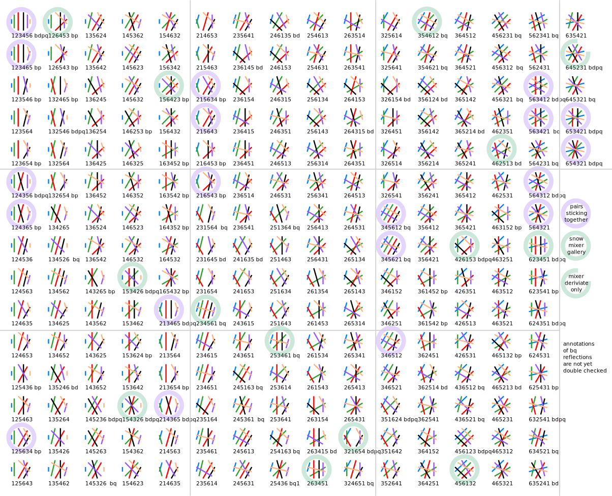
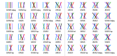
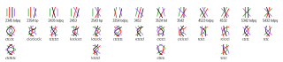
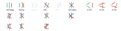

Counting snowflake families
===========================

**... and crossings with fewer pairs**

Contents
--------

  * [Introduction](#introduction)
  * [Bouncing pairs and numbering](#bouncing-pairs-and-numbering)
  * [Notes](#notes)
    * [Pairs or threads](#pairs-or-threads)
    * [Save and edit images](#save-and-edit-images)
    * [Look up of snowflakes](#look-up-of-snowflakes)
    * [Generated content](#generated-content)
  * [6 pairs / threads](#6-pairs--threads)
    * [No bouncing](#no-bouncing)
    * [Bouncing once](#bouncing-once)
    * [Bouncing twice](#bouncing-twice)
  * [5 pairs / threads](#5-pairs--threads)
  * [4 pairs / threads](#4-pairs--threads)
  * [3 pairs](#3-pairs)
  * [2 pairs](#2-pairs)
  * [Exploring families](#exploring-families)
    * [Pair diagrams](#pair-diagrams)
    * [Compose grounds](#compose-grounds)
    * [Choose stitches](#choose-stitches)

Introduction
------------

From [literature](../literature) like "Naar de Bron" and "Viele gute Gründe"
we can collect dozens of pair diagrams for snowflakes. 
That made us curious to explore the number of ways we can make n-pair crossings.
Traditional spiders are crossings with an even number of pairs, 
snowflakes in Binche are usually 4-pair or 6-pair crossings.

To start the exploration we calculate the number of ways 
the sequence of pairs can change after completing a crossing. 
Mathematicians call that permutations. 
The following table shows the number of options for different numbers of pairs involved in a crossing. 
Reflections are options that are the same after mirroring horizontally, vertically or rotating upside down.
The bouncing and other details are explained in following sections.

|                   pairs |    2 |    3 |                 4 |   5 |   6 |    7 |     8 |      9 |
|------------------------:|-----:|-----:|------------------:|----:|----:|-----:|------:|-------:|
|       factorial or _n!_ |    2 |    6 |                24 | 120 | 720 | 5040 | 40320 | 362880 | 
|       minus reflections |    1 |    4 |                13 |  45 | 230 | 1388 | 10558 |  92126 |
|  one pair bouncing once | n.a. |    3 |                12 | 281 | 325 |    ? |     ? |      ? |
|      two bouncing pairs | n.a. | n.a. | ~~&nbsp;4&nbsp;~~ |   ? |  93 |    ? |     ? |      ? |
| one pair bouncing twice | n.a. | n.a. |                 2 |   ? |  56 |    ? |     ? |      ? |

The same changed sequence of pairs can be achieved in many ways by pairs taking other routes than straight ones.
We call it a family of crossings when the pairs end and start in the same sequence.
Because of the large numbers, we only give some examples or hints for the next steps: 
creating family members and choosing stitches.

Bouncing pairs and numbering
----------------------------

A pair that bounces along the perimeter of an n-pair crossing
can take a detour in the surrounding lace.
This turns an n-pair crossing into an (n+1)-pair crossing, 
it can even happen with two pairs, or one pair bouncing between both sides.

The following images illustrate how the numbering works. 
The basic numbers show the order of the pairs at the end.
A prefix and/or suffix indicates which pair bounces, 
they take the place of the first and/or last pair.
An S or Z indicates to which side a twice bouncing pair travels first.

The numbers may be marked with bd, bp or bdpq. 
This is about [internal symmetry](../../images/counting/int-symm.png)

Notes
-----

### Pairs or threads

Thread diagrams can be interpreted as pair diagrams and vice versa.
So when analyzing in how many ways threads/pairs can get reordered at the end of some manipulation,
we get two for the price of 1. 
For example the 6-pair snowflakes are thread diagrams for 3-pair crossings.

### Save and edit images

With main stream browsers you can right-click the images on this page to save them.
You can use  a vector editor like Inkscape, Adobe Illustrator and many others, to modify images with extension SVG. 
For example to make the straight lines squiggle into different pair diagrams or show what is beyond the visible area. 

Another option after right-click is _open in new tab_, that would allow you to select and copy text from the image.

### Look up of snowflakes

Some sets of permutations are also provided as text files, grouped by reflections. 
Only the smallest number in each group is presented as a diagram.
When you find a snowflake somewhere else, write down how the pairs reorder
and look up the number in the text file to identify the family.
The files do not include the bouncing prefixes and suffixes.

### Generated content

Some content of this page is generated with a Python [script](permutations.py). 
It lists and draws permutations of pairs changing positions and filters reflections.
You can run (and modify) the script with various offline and online environments such as
[online-python.com](https://www.online-python.com/)
The output of the scripts is hacked into SVG images shown on this page.
By switching comment on or off for the last few lines of the script you can choose what to generate.

6 pairs / threads
-----------------

The details per group that follow tell us we have 230+325+149=704 families. 
Varying stitches for each family-member gives an ocean of options.

### No bouncing

With six threads or pairs we have 6x5x4x3x2=720 permutations for the order of pairs after completing a snowflake.
After filtering reflected versions we still have 230 options.
20 have internal bdpq reflections, another 28 have only bd reflections and 28 have bp.

[text](permutations-for-6.txt)  
  

### Bouncing once

With one bouncing pair we have (5x4x3x2 - bp reflections) = 73 options.
Note that this is more than for the plain 5-pair crossings where also the bd reflections are removed. 
Five options for each option to let one pair bounce gives 365 options.
However, swapped pairs in permutations marked with `bp` cause duplicates.
We expect to end up with 365-40=325, a challenge left for you, please share your results.

### Bouncing twice

With two pairs bouncing, we can start with the permutations for four pairs.
These are shown on the grey ribbon below.
Two have bdpq reflections, one only bd and one a bp reflection.

Above the ribbon we have 4x3 options for each one with two pairs bouncing pairs what gives 156 options.
Removing duplicates leaves 93. 
Below the ribbon we have 4x2 options of a pair bouncing to both sides, x2 because we can start bouncing to the right or start to the left.
That gives another 56.
The groups add up to 149.

5 pairs / threads
-----------------

With 5 pais we have 5x4x3x2=120 permutations, minus bd and/or bp duplicates we have 45 family heads.

[text](permutations-for-5.txt)    

With one bouncing pair we have (4x3x2 - bp reflections) = 17 options.
Each having 4 pairs to bounce minus 11 
swapped pairs in bp tagged options we expect 281 family heads.

For two bouncing pairs we can use the plain family heads for 3 pairs. 
Again the challenge to explore the bouncing and eliminate duplicates is left to you.

4 pairs / threads
-----------------

With 4 pairs we have 4x3x2=24 minus duplicates gives 13 families.

Without any pretension to be exhaustive,
we show one or two members for each family by squiggling pairs.
Some of these members are common in traditional lace.
Swapping starts and/or ends means dealing with another family. 
The captions of family members interpret the diagrams as thread diagrams,
so you can as well turn to  [Listing & counting stitches](../counting) to explore options.

[text](permutations-for-4.txt)  

With one bouncing pair we have (3x2 - bp reflections) = 5 options
as shown on the left in the grey ribbon.
Each having 3 pairs to bounce minus 3 
swapped pairs in bp tagged options we expect 12 family heads.
On the right side of the ribbon 2 pairs are turned into 4 pair crossing using bouncing.
Below the ribbon we have the family heads. 
Beyond the ribbon we try some family members, with two bouncing pairs
we can only create a sequence of (Brussels) stitches, so we have to dismiss these permutations as family heads.
The dismissed and duplicate-by-reflection options are shown faint. We may have to dismiss more.

3 pairs
-------

With 3 pairs we have 3x2=6 ways to reorder them. The faint permutations in the image below are mirrored duplicates.

Note the bottom member of the 231 family. 
The red pair intersects the two other pairs three times each.
Use your own creativity to create more family members. [More...](../misca#3-paired-join) 

2 pairs
-------

Bobbin lace makers are used to call two pair crossings stitches,
these are explored on [Listing & counting stitches](../counting).

Exploring families
------------------

### Pair diagrams

So far we mainly explored how pairs changed position after making a crossing.

A pair (or groups of pairs) not touching remaining pairs turns a given permutation into separate crossings.
It is tempting to define a crossing as each pair must touch each other pair at least once and no more than twice,
but with bouncing pairs that gets more complicated.
A bouncing pair can also be described as a pair leaving before another one enters.
These two pairs can't interact with one another, yet we may still create a coherent crossing.

Any way, we can make the pairs squiggle their route from start to end 
to make them cross other pairs as we see fit. 
Note that swapping starts and/or ends means dealing with another family. 

The following not-exhaustive families are created manually from some of the generated permutations.
The figure below contains a few more examples beyond the visible area.

  

With bouncing pairs two or three pairs in a family-head have the same color.
The dashed line outside the snowflake suggests it is the same pair.
That might not be the case, depending on what happens outside the snowflake.
It is a reminder that you should not squiggle the lines in such a way
that two lines of the same color cross one another.

### Compose grounds

A bit beyond the subject of counting snowflakes is assembling grounds. 
Our focus is on 6-pair snowflakes. They can be connected directly, via plaits, framed in Paris grounds or whatever.
It needs some attention to prevent loops.

When the number start with 1 and ends with 6
you can't repeat them next to one another without further interaction.
The second family explored above shows you would get loops.

The bouncing variations can also be represented as follows:

Red are incoming pairs, blue are leaving pairs. 
Above we counted in how many ways we can connect each red line to a blue line within the same circle. 
Outside the circles we also should not connect red with red or blue with blue without some exchange.

### Choose stitches

The last step to explore snowflakes and other crossings is to choose stitches for a thread diagram. 
To prepare for that step we can interpret the diagrams of family members as thread diagrams 
and use the droste page of GroundForge. 
So far only recipes without bouncing pairs.

#### 6 pairs

  

We can analyse stitches in a diagram by marking them with blobs. 
On the right a solution for one snowflake of the 563412 family.

Requirements for the blobs: span 4 threads, threads flow two by two into adjacent blobs. 
Not all blobs need to have an interaction for all of its four threads as shown in the 6-blobs solution.

Start with a template from the table below that corresponds with the set of blobs.
Giving stitches a color in the first thread diagram (as shown in the screenshot below the table) 
can help to compare distorted diagrams and detect possible mistakes in your analysis.
The tooltips in the second pair diagram helps to fill in the text box with desired stitches.
The identifiers in the last thread diagram have an extra digit, 
those tooltips can also help to apply corrections. 
PLease don't rely on twist marks in the pair diagrams, they are buggy.

| first blob on the ... | number of blobs                                                        |
|----------------------:|:-----------------------------------------------------------------------|
|                 right | [2][r2], [3][r3], [4][r4], [5][r5], [6][r6], [7][r7], [8][r8], [9][r9] | 
|                  left | [2][l2], [3][l3], [4][l4], [5][l5], [6][l6], [7][l7], [8][l8], [9][l9] | 

[l2]: GroundForge/droste?b1=lc&patchWidth=3&patchHeight=5&paintStitches=rcrc&tile=-5&shiftColsSW=-1&shiftRowsSW=1&shiftColsSE=1&shiftRowsSE=1&
[r2]: GroundForge/droste?b1=rc&patchWidth=3&patchHeight=5&paintStitches=rcrc&tile=-5&shiftColsSW=-1&shiftRowsSW=1&shiftColsSE=1&shiftRowsSE=1&
[l3]: GroundForge/droste?b1=lcl&patchWidth=3&patchHeight=5&paintStitches=rcrc&tile=-5&shiftColsSW=-1&shiftRowsSW=1&shiftColsSE=1&shiftRowsSE=1&
[r3]: GroundForge/droste?b1=rcr&patchWidth=3&patchHeight=5&paintStitches=rcrc&tile=-5&shiftColsSW=-1&shiftRowsSW=1&shiftColsSE=1&shiftRowsSE=1&
[l4]: GroundForge/droste?b1=lclc&patchWidth=3&patchHeight=5&paintStitches=rcrc&tile=-5&shiftColsSW=-1&shiftRowsSW=1&shiftColsSE=1&shiftRowsSE=1&
[r4]: GroundForge/droste?b1=rcrc&patchWidth=3&patchHeight=5&paintStitches=rcrc&tile=-5&shiftColsSW=-1&shiftRowsSW=1&shiftColsSE=1&shiftRowsSE=1&
[l5]: GroundForge/droste?b1=lclc&patchWidth=3&patchHeight=5&paintStitches=rcrc&tile=-5&shiftColsSW=-1&shiftRowsSW=1&shiftColsSE=1&shiftRowsSE=1&
[r5]: GroundForge/droste?b1=rcrc&patchWidth=3&patchHeight=5&paintStitches=rcrc&tile=-5&shiftColsSW=-1&shiftRowsSW=1&shiftColsSE=1&shiftRowsSE=1&
[l6]: GroundForge/droste?b1=lclc&patchWidth=3&patchHeight=5&paintStitches=rcrc&tile=-5&shiftColsSW=-1&shiftRowsSW=1&shiftColsSE=1&shiftRowsSE=1&
[r6]: GroundForge/droste?b1=rcrc&patchWidth=3&patchHeight=5&paintStitches=rcrc&tile=-5&shiftColsSW=-1&shiftRowsSW=1&shiftColsSE=1&shiftRowsSE=1&
[l7]: GroundForge/droste?b1=lclc&patchWidth=3&patchHeight=5&paintStitches=rcrc&tile=-5&shiftColsSW=-1&shiftRowsSW=1&shiftColsSE=1&shiftRowsSE=1&
[r7]: GroundForge/droste?b1=rcrc&patchWidth=3&patchHeight=5&paintStitches=rcrc&tile=-5&shiftColsSW=-1&shiftRowsSW=1&shiftColsSE=1&shiftRowsSE=1&
[l8]: GroundForge/droste?b1=lclc&patchWidth=3&patchHeight=5&paintStitches=rcrc&tile=-5&shiftColsSW=-1&shiftRowsSW=1&shiftColsSE=1&shiftRowsSE=1&
[r8]: GroundForge/droste?b1=rcrc&patchWidth=3&patchHeight=5&paintStitches=rcrc&tile=-5&shiftColsSW=-1&shiftRowsSW=1&shiftColsSE=1&shiftRowsSE=1&
[l9]: GroundForge/droste?b1=lclc&patchWidth=3&patchHeight=5&paintStitches=rcrc&tile=-5&shiftColsSW=-1&shiftRowsSW=1&shiftColsSE=1&shiftRowsSE=1&
[r9]: GroundForge/droste?b1=rcrc&patchWidth=3&patchHeight=5&paintStitches=rcrc&tile=-5&shiftColsSW=-1&shiftRowsSW=1&shiftColsSE=1&shiftRowsSE=1&

#### 4 pairs

The two examples are chosen because one has two twists were the other has just one.
The pair diagrams for [ctcttctc](/GroundForge/stitches.html?patchWidth=7&patchHeight=9&tile=5-&shiftColsSW=-1&shiftRowsSW=1&shiftColsSE=1&shiftRowsSE=1&a1=ctcttctc)
and [ctctctc](/GroundForge/stitches.html?patchWidth=7&patchHeight=9&tile=5-&shiftColsSW=-1&shiftRowsSW=1&shiftColsSE=1&shiftRowsSE=1&a1=ctctctc)
lead to identical diagrams at the droste page.
This is because GroundForge considers anything done with just two pairs (like ctc-pin-ctc) as a single stitch.

#### 3 pairs

Just an example: member 
[lclclc](/GroundForge/droste.html?patchWidth=7&patchHeight=9&tile=5-&shiftColsSW=-1&shiftRowsSW=1&shiftColsSE=1&shiftRowsSE=1&a1=https://d-bl.github.io/GroundForge/droste.html?patchWidth=7&patchHeight=9&tile=5-&shiftColsSW=-1&shiftRowsSW=1&shiftColsSE=1&shiftRowsSE=1&a1=lclclc&droste2=ctc&droste2=ctc)
of the family 123.

Stitches with three pairs are not very logical for a seasoned bobbin lace maker,
It means consistently either no right twists or no left twists. 
GroundForge can handle it, it shows starting pins for each 4th thread but no thread.
Using these basic thread diagrams as pair diagrams (droste effect) is explained in more detail for six pairs. 
