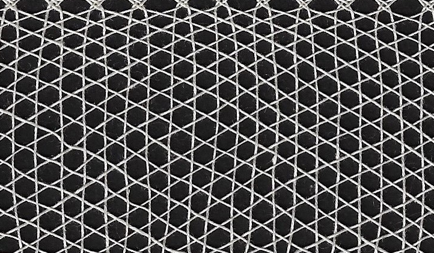

# Catalogue of stitches

## Contents

* [Introduction](#introduction)
* [Stitches](#stitches)

## Introduction

A stitch is defined as something with four bobbins.
On this page, we present an incomplete list of stitches to choose from. There are more than 1000 possibilities.   
On page-to-be counting stiches we show an ordening of the stitches and a way of counting stitches.   

## Stitches
### two

<table>
  <tr><th>stitch</th><th>diagonal net</th><th>horizontal net</th><th>photo</th>
  </tr>
  <tr>
    <td>ct</td>
    <td></td>
    <td></td>
    <td></td>
  </tr>
  <tr>
    <td>cr</td>
    <td></td>
    <td></td>
    <td>photo</td>
  </tr>
  <tr>
    <td></td>
    <td></td>
    <td></td>
    <td></td>
  </tr>
 </table>
  

### three

| stitch | diagonal net | horizontal net | photo |    
| --- | --- | --- | --- | 
| cct | |   | photo |    
| ccr | | | photo |    
|     |                                                   | | photo |    
| ctt | |   | photo |    
| ctr | | | photo |    
|     |                                                   | | photo |    

***
[&uArr;]()

