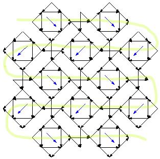
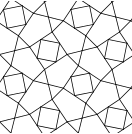
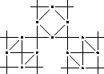
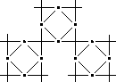
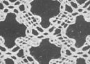

# Droste

## Contents
* [Introduction](#introduction)
* [Fish](#fish)
* [Wobble](#wobble)
* [Paris](#paris)

## Introduction
On this page, several grounds are made with the "Droste-effect": 
reuse thread diagrams as pair diagrams. 
Some of these, like "Wobble" can only be made by GroundForge using this technique. 

See the Groundforge help-page [_Droste-effect_][pg-droste] for more information.  

Some of the examples have forms to make playing easier. 
Other examples only have plain links for multi-step patterns, you need to click the  in the advanced section for the diagrams of the second (or even third) step.

[pg-droste]: https://d-bl.github.io/GroundForge/help/Droste-effect

## Fish     
_Double fish B2,S2,W3_ (see page [_fish_][fish-page])
also can be defined in [two steps][F3-223] using the thread diagram of the first step as pair diagram for the second step. Please replace cross b102 in the thread diagram of step-2 with a half knot or two to mimic a twisted pair.              
The thread diagram of the second step can reused again: click the  below the second step fish.       
The same result as this 3-step fish can be achieved in [two steps][F2-223].          
Defining a footside will become problematic, as we have four workers going into the same direction before returning. In practice you can bend this rule and change direction every other row, provided that plain twists separate the fish. Note that in both cases it can take a while for the last steps to appear.    
Please note the resemblance of the 3-step fish with the [narrow eyed spider][ne-spiders-page]. 

[ne-spiders-page]: https://maetempels.github.io/MAE-gf/docs/spiders#spiders-with-a-narrow-eye
[fish-page]: https://maetempels.github.io/MAE-gf/docs/fish#fish-notation

[F2-223]: https://d-bl.github.io/GroundForge/tiles.html?patchWidth=6&patchHeight=14&b1=ctct&a2=ctct&b3=ct&a4=ctct&b5=ctc&b6=ctcl&a6=ctc&b7=ctc&a7=ctcr&droste2=ctc,b30=tct,b44=a45=b15=b14=tt,b64=a74=ttctctt&tile=-4,5-,-5,5-,-5,21,88&footsideStitch=ctctt&tileStitch=ctct&headsideStitch=ctctt&shiftColsSW=0&shiftRowsSW=7&shiftColsSE=2&shiftRowsSE=7

[F3-223]: https://d-bl.github.io/GroundForge/tiles.html?patchWidth=6&patchHeight=6&a1=ctc&a2=cr&a3=c&a4=lc&droste2=ctc,a10=a11=ctcrr,a20=a21=a40=ctct,a30=ct,,,,&droste3=ctc,a300=tct,a104=a114=ttctctt,a204=a205=a404=a405=tt,&tile=8,1,8,1,&footsideStitch=ctctt&tileStitch=ctct&headsideStitch=ctctt&shiftColsSW=0&shiftRowsSW=4&shiftColsSE=1&shiftRowsSE=4

## Wobble

### Pricking

The left pricking is generated with one of the "ground from template" 
[tools](https://d-bl.github.io/inkscape-bobbinlace/Ground-from-Template)
and a plain text file (<a href="../data/wobble.txt" download>download</a>).
The changing angle of the rose ground units inspired the name.

On the right a distorted version that matches a Torchon grid. 
The units of the rose-ground are placed in different directions, indicated with blue arrows.
These units can be replaced with units of a bias ground.
The green numbers and arrows indicate the working order inherited from the first pair diagram.

### Generate diagrams (color coded / threads)

The first step is the Alternate stich ground. 
After completing the stitches for the second step in the form below,
press go for the desired type of units.
In the page that will appear next, click the 
in the advanced section for the thread diagram.




## Paris

The [Paris] ground uses the thread diagram of the half twist as pair diagram.
See also variations (defined without this Droste technique) in the Whiting index A5, A6, B5, A7-H7, G11. 

In turn thread diagrams of (fancy) Paris grounds can be used as pair diagrams.
Some examples to play with your own choice of stitches.

 [`go`][ex-paris-droste1]
 [`go`][ex-paris-droste2]
 `...`
 [`go`][F12-droste] ([WI F12][F12])

[Paris]: https://d-bl.github.io/GroundForge/tiles?tile=-5&tileStitch=ct&droste2=ctct&patchWidth=5&patchHeight=6&shiftColsSW=-2&shiftRowsSW=0&shiftColsSE=1&shiftRowsSE=1
[F12]: https://d-bl.github.io/GroundForge/tiles?whiting=F12_P190&patchWidth=10&patchHeight=10&f1=ctc&d1=tctct&b1=ctc&g2=ctctctc&e2=tctct&c2=tctct&a2=ctctctc&f3=ctc&d3=tctct&b3=ctc&g4=ctcrrctc&f4=ctc&e4=ctcllctc&c4=ctcrrctc&b4=ctc&a4=ctcllctc&tile=-4-5-7--,b-5-5-c-,-5-5-5--,a15-58d-&footsideStitch=ctctt&tileStitch=ctc&headsideStitch=ctctt&shiftColsSW=-4&shiftRowsSW=4&shiftColsSE=4&shiftRowsSE=4
[F12-droste]: https://d-bl.github.io/GroundForge/tiles?patchWidth=12&patchHeight=16&c1=clcrct&a1=crclct&d2=ctct&droste2=ctct,c11=a13=ctcllctc,a11=c13=ctcrrctc,d25=c10=c12=c14=ctc,d24=a10=a12=a14,a16=c15=ctctctc&tile=B-C-,---5&footsideStitch=ctctt&tileStitch=ctc&headsideStitch=ctctt&shiftColsSW=-2&shiftRowsSW=2&shiftColsSE=2&shiftRowsSE=2
[ex-paris-droste1]: https://d-bl.github.io/GroundForge/tiles?patchWidth=10&patchHeight=10&c1=crclct&a1=clcrct&d2=ctct&droste2=c15=a16=tctctct,a15=c16=tctct,d24=d25=tctct,c12=a12=tct,d20=d21=d22=d23=ctc,c10=c11=c13=c14=ctc,a10=a11=a13=a14=ctc,,&tile=B-C-,---5&tileStitch=ctc&shiftColsSW=-2&shiftRowsSW=2&shiftColsSE=2&shiftRowsSE=2
[ex-paris-droste2]: https://d-bl.github.io/GroundForge/tiles?patchWidth=10&patchHeight=10&c1=clcrct&a1=crclct&d2=ctct&droste2=c15=a16=tctctct,a15=c16=tctct,d24=d25=tctct,c12=a12=tct,d20=d21=d22=d23=ctc,c10=c11=c13=c14=ctc,a10=a11=a13=a14=ctc&tile=B-C-,---5&tileStitch=ctc&shiftColsSW=-2&shiftRowsSW=2&shiftColsSE=2&shiftRowsSE=2

***
