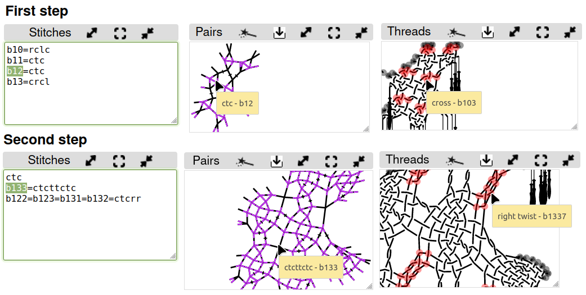

Contents
--------

- [Two approaches](#two-approaches)
- [6 pairs with all pairs entering before leaving](#6-pairs-with-all-pairs-entering-before-leaving)
  - [Two worker pairs](#two-worker-pairs)
    - [Two passive pairs](#two-passive-pairs)
    - [In a Paris ground (under construction)](#in-a-paris-ground-under-construction)
- [6 pairs, on both sides a pair leaves before the last enters](#6-pairs-on-both-sides-a-pair-leaves-before-the-last-enters)
- [4 pairs](#4-pairs)
- [3 pairs](#3-pairs)

Stitches for snowflakes
=======================

A [tutorial] explains how to choose stitches in GroundForge.
This tutorial uses a versatile Binche pattern as an example. 
This happens to be a 6-pair snowflake alias spider embedded in a Paris ground.
As of this writing, the tutorial is still based on a deprecated page. 

[tutorial]: /GroundForge-help/Binche

Two approaches
--------------

Without the Droste approach you have to distort the pair diagram as shown: connect the dots.

The [tutorial] explains how to choose stitches.
Many variations or combinations of pair diagrams require a complete new capture. 

This page explores recipes for more pair diagram variations using the Droste technique:
* interpret pair diagrams as thread diagrams
* apply the resulting stitches to a generic recipe variation
* use the resulting thread diagram as pair diagram
* choose stitches

We can analyse stitches in a diagram by marking them with blobs.
On the right a solution for one snowflake.
The capital R indicates that the first blob is on the right side,
in other words the first stitch would be made with the two pairs on the right.

Requirements for the blobs: span 4 threads, 
the threads flow two by two into adjacent blobs.
Not all threads in a blob need to have an interaction with other threads.

6 pairs with all pairs entering before leaving
----------------------------------------------

### Two worker pairs

The form below requires the blobs to use either the most left four pairs or the most right four pairs.
The initial values of the form initialises the page as shown in te screenshots below the form.



Click wands to generate diagrams. Generate a thread diagram after refreshing the pair diagram.
Giving stitches a color in the first thread diagram
can help to compare distorted diagrams and detect possible mistakes in your analysis.
The tooltips in the second pair diagram help to fill in the text box of the second step with desired stitches.
The identifiers in the last thread diagram have an extra digit,
those tooltips can also help to apply corrections.

Note that a trailing twist in the last blob gets combined with a leading twist of the first blob.
This is counteracted with a ctct(pin)tctc, pins frequently get misplaced, so we leave them out.
PLease don't rely on twist marks in the pair diagrams, they are buggy.

### Two passive pairs

The form for two worker pairs assigns the blobs at the first _threads as pairs_ step, that allows more blobs.

Though distorted, we recognize similar elements for the blobs in this 
[three pair join](/GroundForge/stitches?patchWidth=12&patchHeight=20&b1=clcrc&a1=c&d3=clcrclll&a3=cttt&c4=c&b4=crclc&d6=crclcrrr&c6=cttt&tile=76x-,yxxy,6-x4,x24-,xxww,x-27&tileStitch=ctct&shiftColsSW=0&shiftRowsSW=6&shiftColsSE=4&shiftRowsSE=6)
pattern. This pattern works only for four blobs but provides a traditional constellation of snowflakes.

### In a Paris ground (under construction)

This [pattern](/GroundForge/stitches.html?patchWidth=19&patchHeight=16&tile=-5-,6-5,-5-,5-5,-58,5-4&shiftColsSW=0&shiftRowsSW=6&shiftColsSE=3&shiftRowsSE=3&b1=ct&c2=ct&a2=cllcr&b3=cl&c4=ctc&a4=ct&c5=-&b5=crrcl&c6=ctc&a6=cr&droste2=ctc,c20=c21=b30=b31=c22=a60=a61=a42=b11=ctct,b53=b10=b12=rctct,a23=a40=a41=lctct)
supports snowflakes in a Paris ground as in the [tutorial] but using the Droste technique. Definition for the ring pair at the first _threads as pairs_ step:

    ctc
    c20=c21=b30=b31=c22=a60=a61=a42=b11=ctct
    b53=b10=b12=rctct
    a23=a40=a41=lctct

The screenshot dropped the stitch marked with a grey `+`,
you can restore the stitch with the button `assign to ignored`.
The highlighted stitches in the thread diagram represent the blobs.
The configuration of blobs is not as versatile as for the form above.

6 pairs, on both sides a pair leaves before the last enters
-----------------------------------------------------------

From [counting snow](../counting-snow), we explore two members of a family to demonstrate the two templates.
Beyond the [visible area](#save-and-edit-images) we have a few more family members.

&nbsp;

In the first example above (lct-tcr), each bouncing pair section (the dashed lines) interacts with just one other bouncing pair section.
In the second example we see more interactions between the bouncing pairs.
The first example requires two stitches to define a thread diagram to be used as pair diagram, the second one requires three stitches.

The form below generates the diagrams shown below the form.
Note the subtle difference for the open and closed connection in diagram variations for the three-stitch example.
Follow the link to "_thread diagram as pair diagram_" to select your stitches for the snowflake.



4 pairs
-------

The process starts at another page than for six pairs.
For the two examples below:
[ctcttctc](/GroundForge/stitches.html?patchWidth=7&patchHeight=9&tile=5-&shiftColsSW=-1&shiftRowsSW=1&shiftColsSE=1&shiftRowsSE=1&a1=ctcttctc)
and [ctctctc](/GroundForge/stitches.html?patchWidth=7&patchHeight=9&tile=5-&shiftColsSW=-1&shiftRowsSW=1&shiftColsSE=1&shiftRowsSE=1&a1=ctctctc&droste2=ct,c25=d31=d32=d50=d51=d53=d70=d71=d73=ctc,d32=ctcr,d73=ctct,d53=d70=d71=ctcl).
These examples are chosen because one has two twists were the other has just one.
Follow the link to "_thread diagram as pair diagram_" to select your stitches for the snowflake.
The pair diagrams will be the same for both examples.
This is because GroundForge considers anything done with just two pairs (like ctc-pin-ctc) as a single stitch.

3 pairs
-------

Just an example: member
[lclclc](/GroundForge/droste.html?patchWidth=7&patchHeight=9&tile=5-&shiftColsSW=-1&shiftRowsSW=1&shiftColsSE=1&shiftRowsSE=1&a1=https://d-bl.github.io/GroundForge/droste.html?patchWidth=7&patchHeight=9&tile=5-&shiftColsSW=-1&shiftRowsSW=1&shiftColsSE=1&shiftRowsSE=1&a1=lclclc&droste2=ctc&droste2=ctc)
of the family 123.

Stitches with three pairs are not very logical for a seasoned bobbin lace maker,
It means consistently either no right twists or no left twists.
GroundForge can handle it, it shows starting pins for each 4th thread but no thread.
Using these basic thread diagrams as pair diagrams (droste effect) is explained in more detail for six pairs. 
