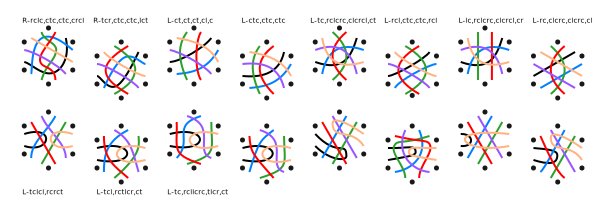
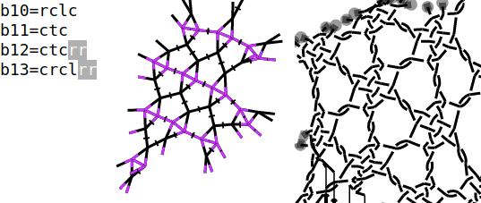
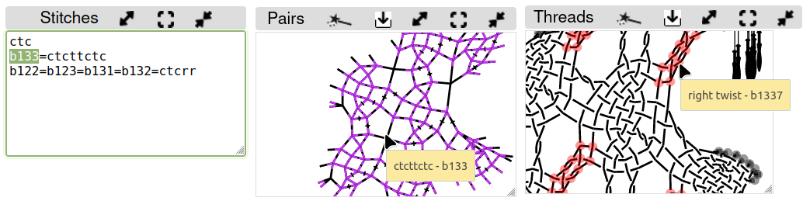
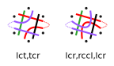
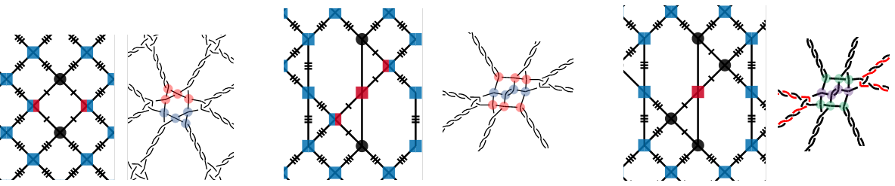
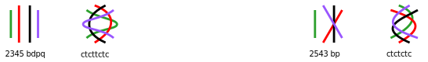

Stitches for snowflakes
=======================

**... and crossings with fewer pairs**

Contents
--------

- [Capture thread diagrams](#capture-pair-diagrams)
- [Pair diagrams interpreted as thread diagrams with blobs](#pair-diagrams-interpreted-as-thread-diagrams-with-blobs)
- [6 pairs with all pairs entering before leaving](#6-pairs-with-all-pairs-entering-before-leaving)
  - [Frames](#frames)
  - [In a Paris ground (under construction)](#in-a-paris-ground-under-construction)
- [6 pairs, on both sides a pair leaves before the last enters](#6-pairs-on-both-sides-a-pair-leaves-before-the-last-enters)
- [4 pairs](#4-pairs)
- [3 pairs](#3-pairs)

A [tutorial] explains how to choose stitches in GroundForge.
That tutorial uses a versatile Binche pattern as an example. 
This happens to be a 6-pair snowflake alias spider embedded in a Paris ground.
However, playing requires some preparation.

[tutorial]: /GroundForge-help/Binche

Capture pair diagrams
-----------------------

Before we can play with stitches, we need to capture the pair diagram.
To start the capture, we have to distort it until each stitch matches a dot on a square grid.
Variations or combinations require new captures. 

This page explores other types of recipes for snowflakes with the aim to apply them in multiple frames.
For this purpose we use the Droste technique:
* interpret pair diagrams as thread diagrams
* apply the stitches resulting from this interpretation to generic recipe variations
* use the resulting thread diagrams as pair diagram
* choose stitches

Pair diagrams interpreted as thread diagrams with blobs
-------------------------------------------------------

We can analyse stitches in a diagram by marking them with blobs.
On the right a solution for one snowflake.
The caption describes the blob sequence.
The capital R indicates that the first blob is on the right side,
in other words the first stitch would be made with the two pairs on the right.
These two pairs become four pairs after a _pairs from threads_ step.

Requirements for the blobs: span 4 threads, 
the threads flow two by two into adjacent blobs.
Not all threads in a blob need to have an interaction with other threads.

We figured out some  blob recipes as test cases.
Due to the vast [numbers](../counting-snow) of possible snowflakes we can´t be exhaustive.
<a href="654321.svg" target="_blank">Show</a>
the collection of samples in another tab to copy the recipes in the captions.

6 pairs with all pairs entering before leaving
----------------------------------------------

Try the blob recipes copied above in the following form.
_Do nothing_ for the footside means: the pairs turn as a rainbow around the pin, without twists.



&nbsp;

The form starts under the hood with three thread plaits. The length of the plaits are determined by the number of blobs.

The form then jumps to _pairs from threads_ to generate diagrams as shown below at the first step. 
Well, we cheated a little: some twists are added manually for the legs of the spider.

At the last step you can finally choose your stitches.

Note that a trailing twist in the last blob gets combined with a leading twist of the first blob.
This is counteracted with a ctct(pin)tctc. Pins usually get misplaced, so we leave them out.

Hover with your mouse over stitches. Highlights can show you all parts of a stitch.
Note that each thread diagram adds a digit to stitch id in the tooltips.

Both can help to fix mistakes as the leg inside the spider in this example.
Click wands to generate or refresh diagrams. 
Refresh a thread diagram after refreshing the pair diagram.
PLease don't rely on twist marks in the pair diagrams, they are buggy in this style of pair diagrams.

### Frames

When we focus on recipes with four blobs, we can recognize `<|>` shapes in the pair diagram of the first step.
These shapes occur in many patterns.
This means we can use three pair joins in these patterns, or snowflakes when using the thread diagram as pair diagram.

 &nbsp;  &nbsp; 

### In a Paris ground (under construction)

This [pattern](/GroundForge/stitches.html?patchWidth=19&patchHeight=16&tile=-5-,6-5,-5-,5-5,-58,5-4&shiftColsSW=0&shiftRowsSW=6&shiftColsSE=3&shiftRowsSE=3&b1=ct&c2=ct&a2=cllcr&b3=cl&c4=ctc&a4=ct&c5=-&b5=crrcl&c6=ctc&a6=cr&droste2=ctc,c20=c21=b30=b31=c22=a60=a61=a42=b11=ctct,b53=b10=b12=rctct,a23=a40=a41=lctct)
supports snowflakes in a Paris ground as in the [tutorial] but using the Droste technique. Definition for the ring pair at the first _pairs from threads_ step:

    ctc
    c20=c21=b30=b31=c22=a60=a61=a42=b11=ctct
    b53=b10=b12=rctct
    a23=a40=a41=lctct

The screenshot dropped the stitch marked with a grey `+`,
you can restore the stitch with the button `assign to ignored`.
The highlighted stitches in the thread diagram represent the blobs.
The configuration of blobs is not as versatile as for the form above.

6 pairs, on both sides a pair leaves before the last enters (under construction)
--------------------------------------------------------------------------------

From [counting snow](../counting-snow), we explore two members of a family to demonstrate the two templates.
Beyond the [visible area](#save-and-edit-images) we have a few more family members.

&nbsp;

In the first example above (lct-tcr), each bouncing pair section (the dashed lines) interacts with just one other bouncing pair section.
In the second example we see more interactions between the bouncing pairs.
The first example requires two stitches to define a thread diagram to be used as pair diagram, the second one requires three stitches.

The following form generates the diagrams shown below the form.
Note the subtle difference for the open and closed connection in diagram variations for the three-stitch example.
Follow the link to "_thread diagram as pair diagram_" to select your stitches for the snowflake.



The number of legs is deceptive, caused by the bouncing pairs. 
We can get more realistic lengths for the legs at the next step.

4 pairs
-------

The process starts at another page than for six pairs.
For the two examples below:
[ctcttctc](/GroundForge/stitches.html?patchWidth=7&patchHeight=9&tile=5-&shiftColsSW=-1&shiftRowsSW=1&shiftColsSE=1&shiftRowsSE=1&a1=ctcttctc)
and [ctctctc](/GroundForge/stitches.html?patchWidth=7&patchHeight=9&tile=5-&shiftColsSW=-1&shiftRowsSW=1&shiftColsSE=1&shiftRowsSE=1&a1=ctctctc&droste2=ct,c25=d31=d32=d50=d51=d53=d70=d71=d73=ctc,d32=ctcr,d73=ctct,d53=d70=d71=ctcl).
These examples are chosen because one has two twists were the other has just one.
Follow the link to "_thread diagram as pair diagram_" to select your stitches for the snowflake.
The pair diagrams will be the same for both examples.
This is because GroundForge considers anything done with just two pairs (like ctc-pin-ctc) as a single stitch.

3 pairs
-------

Just an example: member
[lclclc](/GroundForge/droste.html?patchWidth=7&patchHeight=9&tile=5-&shiftColsSW=-1&shiftRowsSW=1&shiftColsSE=1&shiftRowsSE=1&a1=https://d-bl.github.io/GroundForge/droste.html?patchWidth=7&patchHeight=9&tile=5-&shiftColsSW=-1&shiftRowsSW=1&shiftColsSE=1&shiftRowsSE=1&a1=lclclc&droste2=ctc&droste2=ctc)
of the family 123.

Stitches with three pairs can defy the muscle memory for a seasoned bobbin lace maker.
It means consistently either no right twists or no left twists.
GroundForge can handle it, it shows starting pins for each 4th thread but no thread.
Using these basic thread diagrams as pair diagrams (Droste effect) is explained in more detail for six pairs. 
