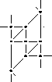

# test

dit is een nieuwe test: 

 

[pdf-test]: ../documents/streched-paris.pdf

![test][svg-test]   

[svg-test]: ../images_flanders/flanders.svg

![test 2][test2]             

[test2]: ../images/bias/2111-nt.png

buttons test

<a href="../images_stitches/paris-lcr.png">
<button type="button"></button>
</a>  

  

test include met if erin, werkt nog niet goed
 

 

***
[&uArr;]()

[p-paris-lcr]: ../images_stitches/paris-lcr.png            
[lijntje]: /GroundForge/tiles?patchWidth=16&patchHeight=16&a1=ctct&b1=ct&d1=ct&a2=ct&c2=ct&shiftColsSE=3&shiftRowsSE=1&shiftColsSW=-4&shiftRowsSW=1&tile=88-1,4-58

