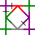

# test

buttons test

<a href="../images/flanders2/105-1.png">
<button type="button"></button>
</a>  

  

test include met zonder erin, test nogmaals

 

***
[&uArr;]()

[p-paris-lcr]: ../images/flanders2/105-1.png.png            

